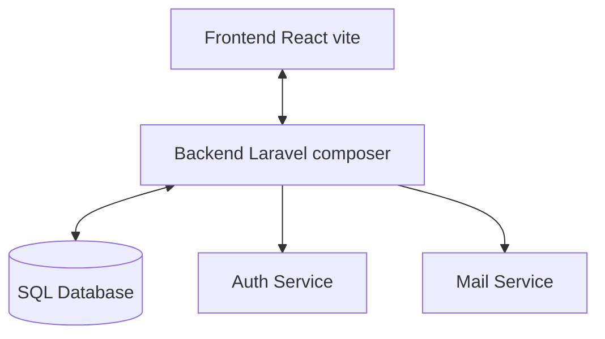

# Home Page Project 🚀

## Motivation

Meine alte Homepage (siehe [Archivlink 2014](https://web.archive.org/web/20141218065649/http://sokdesign.de/)) stellte vor allem Design-Arbeiten dar.  
Da mein Schwerpunkt in der **Programmierung** liegt, brauchte die Homepage dringend ein Update. Oktober 2025 gibt es die Seite mit modernem Tech-Stack und einer selbst gebauten Template Engine als MVP zur Präsentation von Code.

---

## Features

- 🔐 **Authentifizierung**

  - Session-basiert
  - Google/GitHub OAuth
  - Zugriffskontrolle auf geschützte Bereiche

- 🧩 **Template Engine**

  - Layouts erstellen, speichern, löschen
  - HTML-Export per Klick
  - Validierung gegen doppelte Namen & Konfigurationen

- ⚡ **Single Page App**

  - Stateful Components
  - Schnelle UI ohne kompletten Reload

- 📊 **Tests**

  - ~99% Coverage in Frontend & Backend
  - Docker Service für backend Testing

- 📦 **Dockerized Services**
  - Separat startbare Container für Frontend, Backend, Mail, DB

---

## Architekturübersicht

