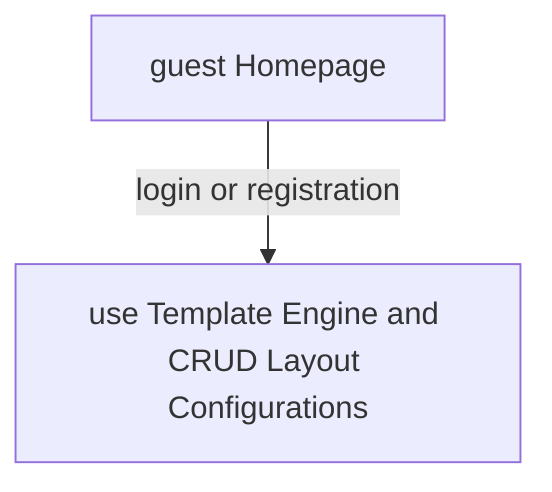
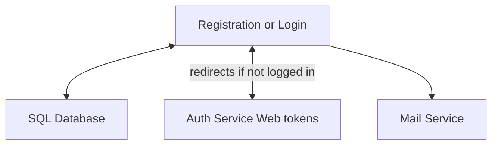
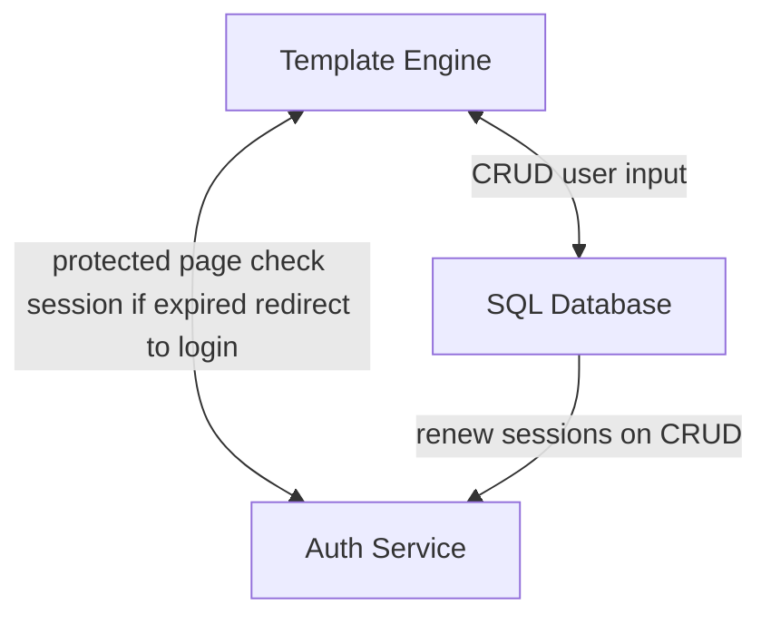

# Frontend

## Tech Stack

- **Core:** React 19, Axios, React Hot Toast
- **State & Routing:** Redux Toolkit, React Router
- **Build & Tools:** Vite, TypeScript, ESLint, PostCSS
- **Styling:** CSS, TailwindCSS
- **UI Libraries:** MUI, HeadlessUI
- **Testing:** Vitest, React Testing Library, MSW, JSDOM, Faker

👉 Details zu allen Dependencies findest du in der [`package.json`](./package.json).

---

## Schnellstart

```bash
# Frontend starten (Entwicklung)
cd frontend
npm install
npm run dev
```

```bash
# Tests ausführen
npm run test
```

---

## Scripts

```bash
`npm run dev` → Development-Server starten
`npm run build` → Produktionsbuild erstellen (`tsc` + `vite build`)
`npm run lint` → Linting prüfen (ESLint)
`npm run preview` → Produktionsbuild lokal starten
`npm run test` → Tests ausführen (Vitest CLI)
`npm run test:ui` → Tests mit UI starten (Vitest UI)
`npm run coverage` → Testabdeckung ermitteln
```

---

### Environment Variables

```env
# Server & API
VITE_SERVER_BASE_URL=http://localhost:8000
VITE_API_BASE_URL=http://localhost:8000/api
```

#### Projektstruktur (Kurzüberblick)

```bash
frontend/
 ├─ src/
 │   ├─ components/                 # UI-Komponenten Homepage
 │   │     └─ auth/                 # UI-Komponenten für Authentifizierung
 │   │          └─ api/             # Auth API Calls
 │   ├─ componentsTemplateEngine/   # Komponenten Template-Engine
 │   │     └─ gridConfiguration/    # dynamisches Layout Grid
 │   │          ├─ markup/          # Markup Generator für das Layout Grid
 │   │          └─ ui/              # Input Slider zur Dynamisierung des Layout Grids
 │   ├─ data/                       # Statische Daten
 │   ├─ hooks/                      # wiederverwendbare react hooks
 │   ├─ pages/                      # Seiten
 │   ├─ providers/                  # interceptor for cookies and response standards
 │   ├─ schemas/                    # Auth zod blueprints für auth api
 │   ├─ store/                      # state with seperate selectors, thunks and reducers
 │   ├─ services/                   # API Calls
 │   ├─ tests/                      # für gesamten ausführbaren code in src. Mocks, helper für Test Standardisierung
 │   ├─ themes/                     # MUI Themes mit Farb, Font, BP und Komponenten Einstellungen
 │   ├─ types/                      # Type Definitionen
 │   └─ utils/                      # helper zur Standardisierung z.B. für logger oder oder HTTP Responses
 └─ public/                         # Statische Dateien
```

#### Testing

```markdown
- **Unit & Integration Tests** mit [vitest, React Testing Library](https://vitest.dev/), (https://testing-library.com/docs/react-testing-library/intro/)
- **Factories** für Testdaten [Faker](https://fakerjs.dev/api/)
- **Custom Helpers** (z. B. für States, Navigation, Integration)
- **Mocking**: [api, db queries, tokens](https://mswjs.io/), (https://github.com/mswjs/data)
```

## Architekturübersicht

#### Mit Login ist die Template Engine nutzbar



#### Die route Temlate Engine ist über das Frontend geschützt nur eingeloggte User haben Zutritt



#### Handling User Inputs und Auth Sessions


